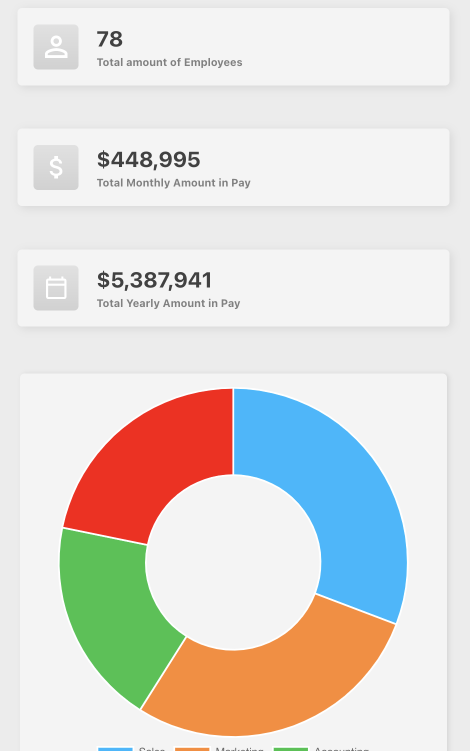
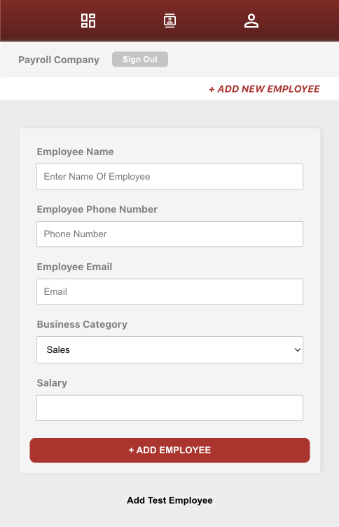
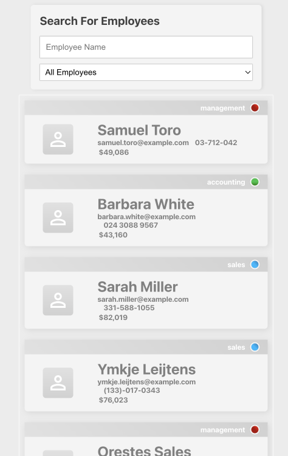

## Payroll | Web Application

#### [Live Website Link](https://payroll-app-ctw.herokuapp.com/Login)

---

#### Full Stack C.R.U.D App For Tracking Employees Salary and Contact Information

---

## 

---

### Application Features

---

- Dashboard containing total employees, payment amount, and position breakdown
- Employee creation with emails, phone numbers and salaries
- List component of all employees with filtered search

---

## Technology Used

---

### [ Frontend ]

- React
- Redux
- styled components
- FadeIn.js

---

### [ Backend ]

- MongoDb
- Node.js
- Express
- JWT (Json Web Tokens)

---
